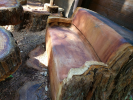

# pnm-images-test

These are provided by Thomas Richter <richter@rus.uni-stuttgart.de>
with these descriptions:

### honolulu.zip:

This is the "honolulu test set", a couple of structurally challenging images.
They easily loose structure due to compression and have been found useful for
testing. The images are copyright Olivier Pfeiffer,
available under CC-nc-by license. A release is inside.

### hdcompare.zip:

This is the HDPhoto test image set, provided by Microsoft. It contains a
couple of interesting stress images for compression purposes. A formal
release is inside. Please note that I believe that MS probably optimized
HDPhoto aka JPEG XR a bit too much for this test set as it performs a bit
weaker on other image sets.

### richard.zip:

This is a small test set of images of higher dynamic range provided by
Richard Clark (former web master of SC29 WG1).

### core1.zip:

This is a subset of the above image sets, namely the "AIC core 1 test image
set" that has been selected for subjective evaluation. This test
image set contains images that are easily degraded by compression and
thus more critical than other images. It is a subset from the Honolulu
set and the HDPhoto set.

### [lossy-image-compression](https://github.com/abskj/lossy-image-compression):

